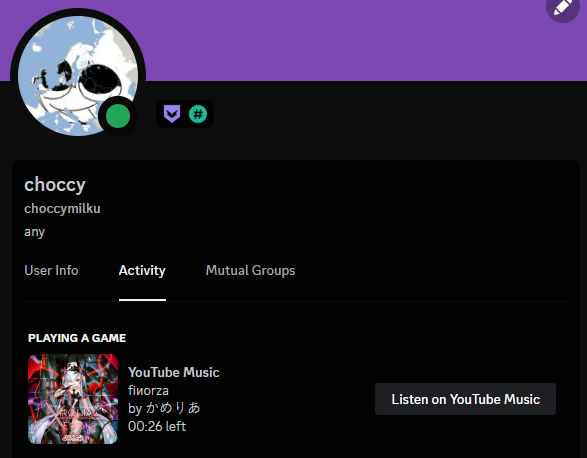

# Discord RPC for YouTube Music and SoundCloud

# Installing

* Add the [userscript](https://github.com/choccymilku/discord-ytm-sc-music-rpc/tree/main/userscripts) via [TamperMonkey](https://www.tampermonkey.net/) 
* Go to "code" folder and run the .bat file (sc - SoundCloud, ytm - YouTube Music (it will also open the web dashboard))
* Listen to something on your browser

# other stuff

* supports skipping music (seeking)
* ⚠ you need to have discord open in order for the RPC to connect, otherwise the server won't work (you can restart the server from the dashboard, or using CLI)

# planned things

* run one server for both RPC (still figuring out)
* possibly allow making any kind of an RPC without much effort

# How It Works

The userscript watches YTM or SC for updates via the [Media Session API](https://developer.mozilla.org/en-US/docs/Web/API/Media_Session_API), send the info to the server by making an HTTP request to `localhost:19347`. When the app receives an update, it updates your Discord activity.

# Should you use this?

if you want, PreMid has more to offer (but places its name everywhere), if it doesn't bother you, use it.